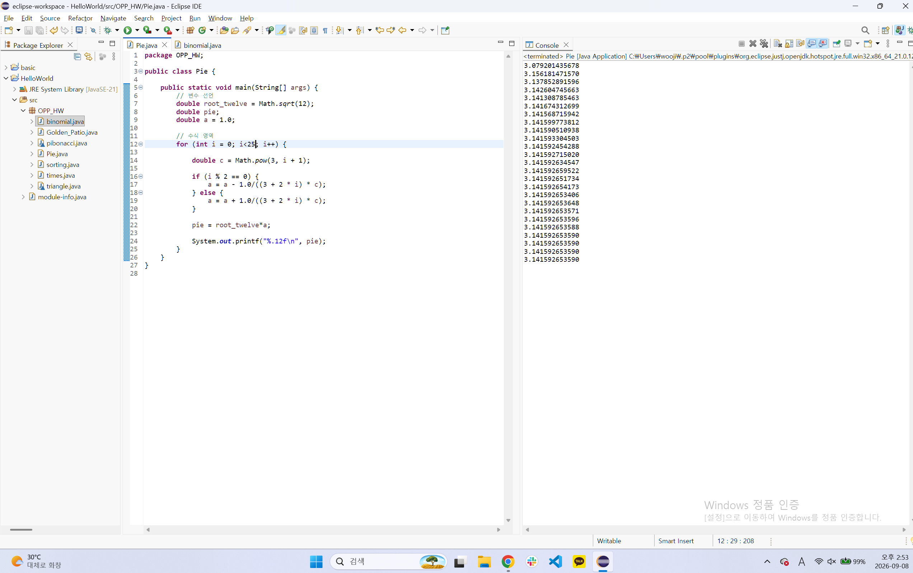
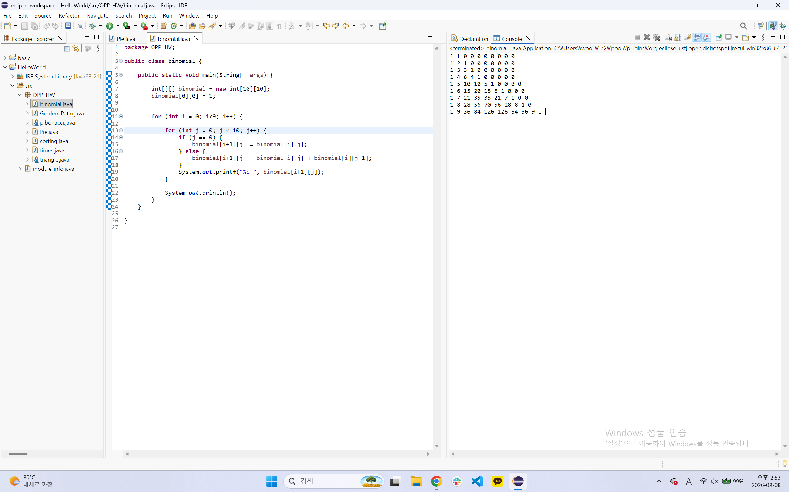
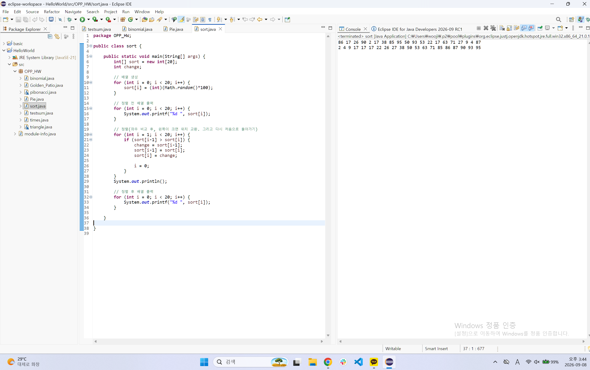
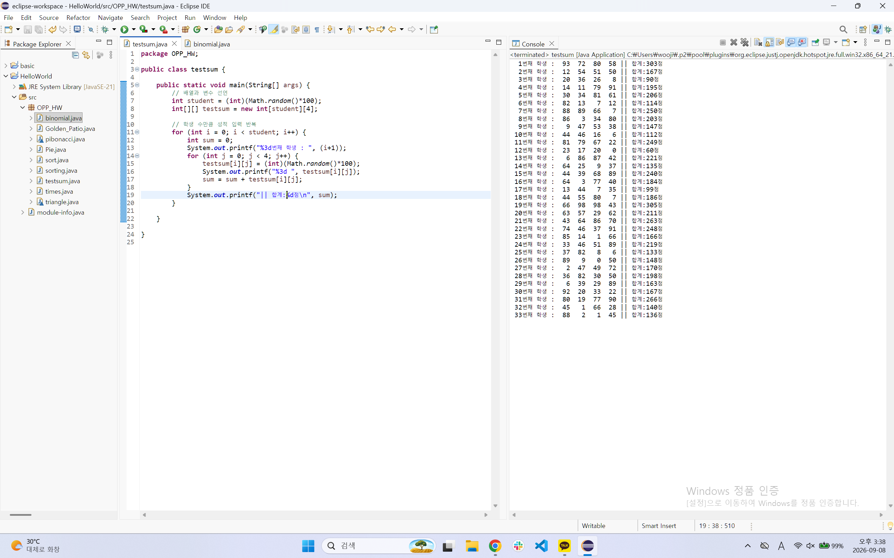
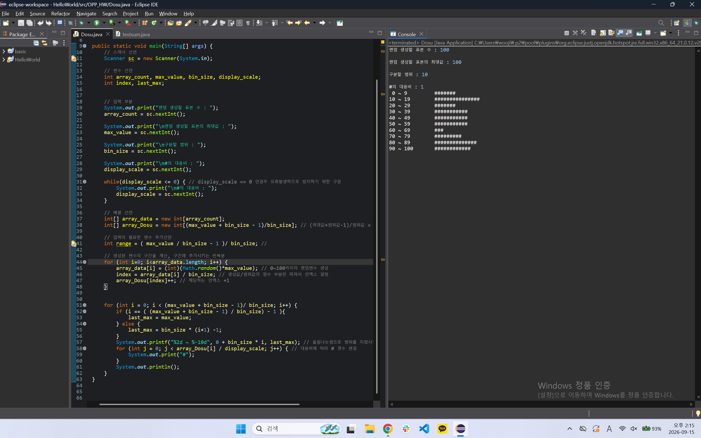
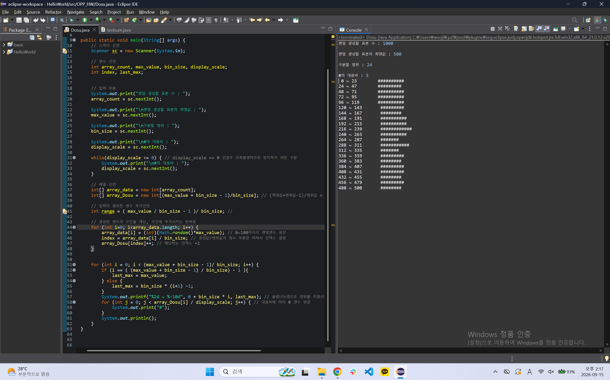
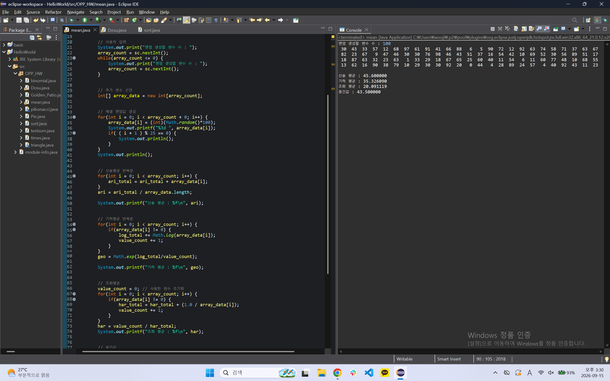
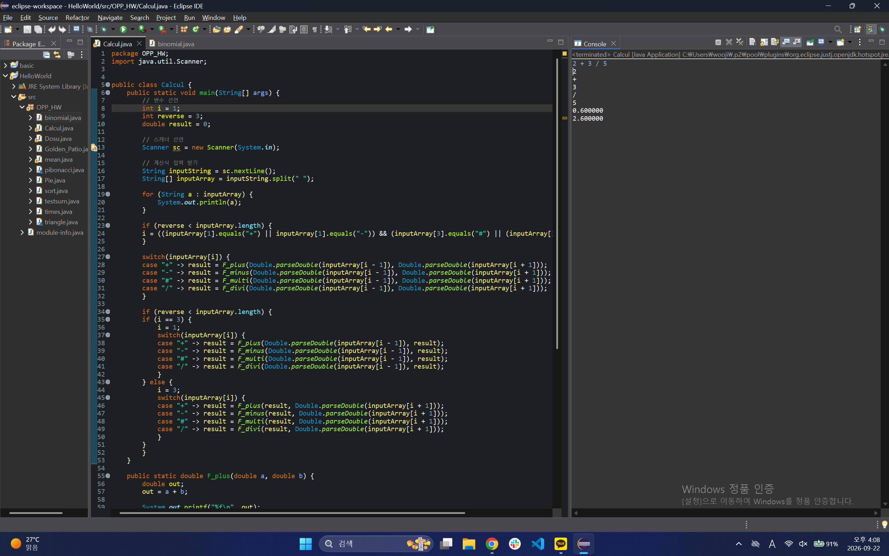

# OOP2026

## [Week1 Homework](#Homework1)
## [Week2 Homework](#Homework5)
## [Week3 Homework](#Homework10)
## [Week4 Homework](#Homework13)


<details>
<summary>Week1 Homework</summary>
	
### Homework1
```java
class triangle {
    public static void main(String[] args) {
        for (int i=0; i<10; i++){
            for(int j=0; j<=i; j++){
                System.out.print("#");
            }
            for(int j=i+1; j<10;j++){
                System.out.print(" ");
            }
            System.out.println();
        }
        System.out.println();

        for (int i=0; i<10; i++){
            for(int j=i; j<10; j++){
                System.out.print("#");
            }
            for(int j=0; j<=i-1; j++){
                System.out.print(" ");
            }
            System.out.println();
        }
        System.out.println();

        for (int i=0; i<10; i++){
            for(int j=i+1; j<10; j++){
                System.out.print(" ");
            }
            for(int j=0; j<=i; j++){
                System.out.print("#");
            }
            System.out.println();
        }
        System.out.println();

        for (int i=0; i<10; i++){
            for(int j=0; j<i; j++){
                System.out.print(" ");
            }
            for(int j=i; j<10; j++){
                System.out.print("#");
            }
            System.out.println();
        }    
    }
}
```


### Homework2
```java
class pibonacci {
    public static void main(String[] args) {
        int a=1, b=1, c;

        System.out.print("1 1 ");

        for(int i=0; i<18; i++){
            c = a+b;
            System.out.print(c+" ");
            a=b;
            b=c;
        }
    }
}
```


### Homework3
```java
public class Golden_Patio {
	public static void main(String[] args) {
		int a=1, b=1, c;
		double ratio;
		
		for(int i=0; i<20; i++) {
			c=a+b;
			ratio=(double)c/b;
			System.out.printf("%.12f\n", ratio);
			a=b;
			b=c;
		}
	}
}
```


### Homwork4
```java
public class times {

	public static void main(String[] args) {
		for(int i=1; i<10; i++) {
			for(int j=1; j<10; j++) {
				System.out.print(j + "*" + i + "=" + j*i + " ");
			}
			System.out.println();
		}
	}

}
```


</details>

<details>
<summary>Week2 Homework</summary>
	
### Homework5
```java
public class Pie {

	public static void main(String[] args) {
		// 변수 선언 
		double root_twelve = Math.sqrt(12);
		double pie;
		double a = 1.0;
		
		// 수식 영역
		for (int i = 0; i<25; i++) {
			
			double c = Math.pow(3, i + 1);
			
			if (i % 2 == 0) {
				a = a - 1.0/((3 + 2 * i) * c);
			} else {
				a = a + 1.0/((3 + 2 * i) * c);
			}
			
			pie = root_twelve*a;
			
			System.out.printf("%.12f\n", pie);
		}
	}	
}
```




### Homework6
```java
public class binomial {

	public static void main(String[] args) {
		// 배열 선언
		int[][] binomial = new int[10][10];
		binomial[0][0] = 1;
		
		// 1행 출력
		for (int i = 0; i < 10; i++) {
			System.out.printf("%3d ",binomial[0][i]);
		}
		System.out.println();
		
		// 2행 이후 출력
		for (int i = 0; i<9; i++) {
			for (int j = 0; j < 10; j++) {
				if (j == 0) {
					binomial[i+1][j] = binomial[i][j];
				} else {
					binomial[i+1][j] = binomial[i][j] + binomial[i][j-1];
				}
				System.out.printf("%3d ", binomial[i+1][j]);
			}
			
			System.out.println();
		}
	}

}

```




### Homework7
```java
public class sort {

	public static void main(String[] args) {
		int[] sort = new int[20];
		int change;
		
		// 배열 생성
		for (int i = 0; i < 20; i++) {
			sort[i] = (int)(Math.random()*100);
		}
		
		// 정렬 전 배열 출력
		for (int i = 0; i < 20; i++) {
			System.out.printf("%d ", sort[i]);
		}
		
		// 정렬(좌우 비교 후, 왼쪽이 크면 위치 교환. 그리고 다시 처음으로 돌아가기)
		for (int i = 1; i < 20; i++) {
			if (sort[i-1] > sort[i]) {
				change = sort[i-1];
				sort[i-1] = sort[i];
				sort[i] = change;
				
				i = 0;
			}
		}
		System.out.println();
		
		// 정렬 후 배열 출력
		for (int i = 0; i < 20; i++) {
			System.out.printf("%d ", sort[i]);
		}
		
	}

}
```




### Homework8
```java
public class testsum {

	public static void main(String[] args) {
		// 배열과 변수 선언
		int student = (int)(Math.random()*100);
		int[][] testsum = new int[student][4];
		
		// 학생 수만큼 성적 입력 반복
		for (int i = 0; i < student; i++) {
			int sum = 0;
			System.out.printf("%3d번째 학생 : ", (i+1));
			for (int j = 0; j < 4; j++) {
				testsum[i][j] = (int)(Math.random()*100);
				System.out.printf("%3d ", testsum[i][j]);
				sum = sum + testsum[i][j];
			}
			System.out.printf("|| 합계:%d점\n", sum);
		}
		
	}

}
```



</details>


<details>
<summary>Week3 Homework</summary>
	
### Homework10

```java
import java.util.Random;
import java.util.Scanner;


public class Dosu {

	public static void main(String[] args) {
		// 스캐너 선언
		Scanner sc = new Scanner(System.in);
		
		// 변수 선언
		int array_count, max_value, bin_size, display_scale;
		int index, last_max;

		
		// 입력 부분
		System.out.print("랜덤 생성할 표본 수 : ");
		array_count = sc.nextInt();
		
		System.out.print("\n랜덤 생성할 표본의 최댓값 : ");
		max_value = sc.nextInt();
		
		System.out.print("\n구분할 범위 : ");
		bin_size = sc.nextInt();
		
		System.out.print("\n#의 대응비 : ");
		display_scale = sc.nextInt();
		
		while(display_scale <= 0) { // display_scale == 0 인경우 오류발생하므로 방지하기 위한 구문
			System.out.print("\n#의 대응비 : ");
			display_scale = sc.nextInt();
		}
		
		// 배열 선언
		int[] array_data = new int[array_count];
		int[] array_Dosu = new int[(max_value + bin_size - 1)/bin_size]; // (최댓값+범위값-1)/범위값 = 필요한 배열의 크기를 구하기 위한 올림나눗셈
		
		// 입력이 필요한 변수 추가선언
		int range = ( max_value / bin_size - 1 )/ bin_size; //
		
		// 생성된 변수의 구간을 계산, 구간에 추가시키는 반복분
		for (int i=0; i<array_data.length; i++) {
			array_data[i] = (int)(Math.random()*max_value); // 0~100까지의 랜덤변수 생성
			index = array_data[i] / bin_size; // 생성값/범위값의 정수 부분만 따져서 인덱스 결정
			array_Dosu[index]++; // 해당하는 인덱스 +1
		}
		
		
		for (int i = 0; i < (max_value + bin_size - 1)/ bin_size; i++) {
			if (i == ( (max_value + bin_size - 1) / bin_size) - 1 ){
				last_max = max_value;
			} else {
				last_max = bin_size * (i+1) -1;
			}
			System.out.printf("%2d ~ %-10d", 0 + bin_size * i, last_max); // 올림나눗셈으로 범위를 지정시킬 수 있도록 함.
			for (int j = 0; j < array_Dosu[i] / display_scale; j++) { // 대응비에 따라 # 갯수 변경
				System.out.print("#");
			}
			System.out.println();
		}
	}

}
```




### Homwork 11
```java
import java.util.Scanner;
import java.util.Random;

public class mean {

	public static void main(String[] args) {
		// 스캐너 선언
		Scanner sc = new Scanner(System.in);
		
		
		// 변수 선언
		int array_count, change;
		double ari, geo, har, center;
		
		int value_count = 0;
		int geo_total = 1;
		double log_total = 0, har_total = 0, ari_total = 0;
		
		// 사용자 입력
		System.out.print("랜덤 생성할 변수 수 : ");
		array_count = sc.nextInt();
		while(array_count <= 0) {
			System.out.print("랜덤 생성할 변수 수 : ");
			array_count = sc.nextInt();
		}
		
		
		// 추가 변수 선언
		int[] array_data = new int[array_count];
		
		
		// 배열 랜덤값 생성
		for(int i = 0; i < array_count + 0; i++) {
			array_data[i] = (int)(Math.random()*100);
			System.out.printf("%3d ", array_data[i]);
			if( ( i + 1 ) % 25 == 0) {
				System.out.println();
			}
		}
		System.out.println();
		
		
		// 산술평균 반복문
		for(int i = 0; i < array_count; i++) {
			ari_total = ari_total + array_data[i];
		}
		ari = ari_total / array_data.length;
		
		System.out.printf("산술 평균 : %f\n", ari);
		
		
		// 기하평균 반복문
		for(int i = 0; i < array_count; i++) {
			if(array_data[i] != 0) {
				log_total += Math.log(array_data[i]);
				value_count += 1;
			}
		}
		geo = Math.exp(log_total/value_count);
		
		System.out.printf("기하 평균 : %f\n", geo);
		
		
		// 조화평균
		value_count = 0; // 사용한 변수 초기화
		for(int i = 0; i < array_count; i++) {
			if(array_data[i] != 0) {
				har_total = har_total + (1.0 / array_data[i]);
				value_count += 1;
			}
		}
		har = value_count / har_total;
		System.out.printf("조화 평균 : %f\n", har);
		
		
		// 중간값
		// 정렬 실시
		for (int i = 1; i < array_count; i++) {
			if (array_data[i-1] > array_data[i]) {
				change = array_data[i-1];
				array_data[i-1] = array_data[i];
				array_data[i] = change;
				
				i = 0;
			}
		}
		
		if(array_data.length % 2 == 0) {
			center = (array_data[array_data.length / 2 - 1] + array_data[(array_data.length / 2)]) / 2.0;
		} else {
			center = array_data[array_data.length / 2];
		}
		
		System.out.printf("종간값 : %f", center);
	}
}
```




</details>


<details>
<summary>Week4 Homework</summary>
```java
import java.util.Scanner;


public class Calcul {
	public static void main(String[] args) {
		// 변수 선언
		int i = 1;
		int reverse = 3;
		double result = 0;
		
		// 스캐너 선언
		Scanner sc = new Scanner(System.in);
		
		// 계산식 입력 받기
		String inputString = sc.nextLine();
		String[] inputArray = inputString.split(" ");
		
		for (String a : inputArray) {
			System.out.println(a);
		}
		
		if (reverse < inputArray.length) {
		i = ((inputArray[1].equals("+") || inputArray[1].equals("-")) && (inputArray[3].equals("#") || (inputArray[3].equals("/")))) ? 3 : 1;
		}
		
		switch(inputArray[i]) {
		case "+" -> result = F_plus(Double.parseDouble(inputArray[i - 1]), Double.parseDouble(inputArray[i + 1]));
		case "-" -> result = F_minus(Double.parseDouble(inputArray[i - 1]), Double.parseDouble(inputArray[i + 1]));
		case "#" -> result = F_multi(Double.parseDouble(inputArray[i - 1]), Double.parseDouble(inputArray[i + 1]));
		case "/" -> result = F_divi(Double.parseDouble(inputArray[i - 1]), Double.parseDouble(inputArray[i + 1]));
		}
		
		if (reverse < inputArray.length) {
		if (i == 3) {
			i = 1;
			switch(inputArray[i]) {
			case "+" -> result = F_plus(Double.parseDouble(inputArray[i - 1]), result);
			case "-" -> result = F_minus(Double.parseDouble(inputArray[i - 1]), result);
			case "#" -> result = F_multi(Double.parseDouble(inputArray[i - 1]), result);
			case "/" -> result = F_divi(Double.parseDouble(inputArray[i - 1]), result);
			}
		} else {
			i = 3;
			switch(inputArray[i]) {
			case "+" -> result = F_plus(result, Double.parseDouble(inputArray[i + 1]));
			case "-" -> result = F_minus(result, Double.parseDouble(inputArray[i + 1]));
			case "#" -> result = F_multi(result, Double.parseDouble(inputArray[i + 1]));
			case "/" -> result = F_divi(result, Double.parseDouble(inputArray[i + 1]));
			}
		}
		}
	}
	
	public static double F_plus(double a, double b) {
		double out;
		out = a + b;
		
		System.out.printf("%f\n", out);
		return out;
	}
	
	public static double F_minus(double a, double b) {
		double out;
		out = a - b;
		
		System.out.printf("%f\n", out);
		return out;
	}
		
	public static double F_multi(double a, double b) {
		double out;
		out = a * b;
		
		System.out.printf("%f\n", out);
		return out;
	}
	
	public static double F_divi(double a, double b) {
		double out;
		out = a / b;
		
		System.out.printf("%f\n", out);
		return out;
	}
}
```



</details>
