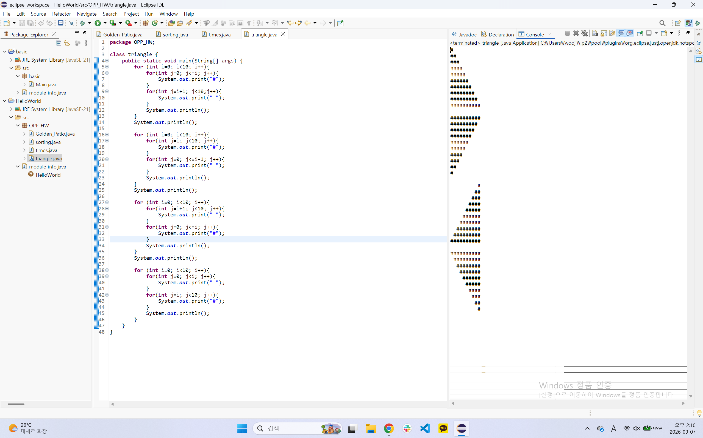
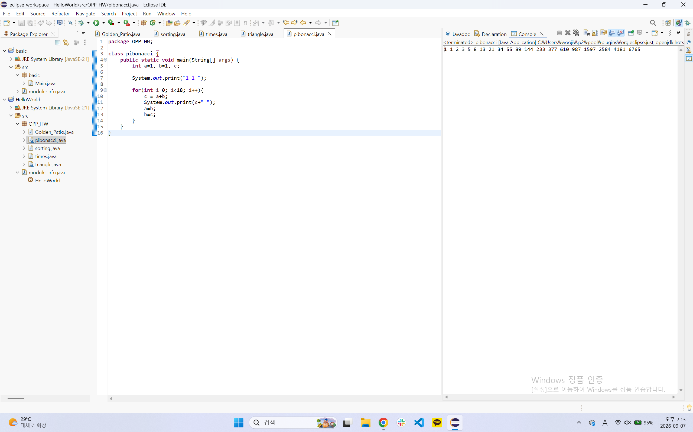
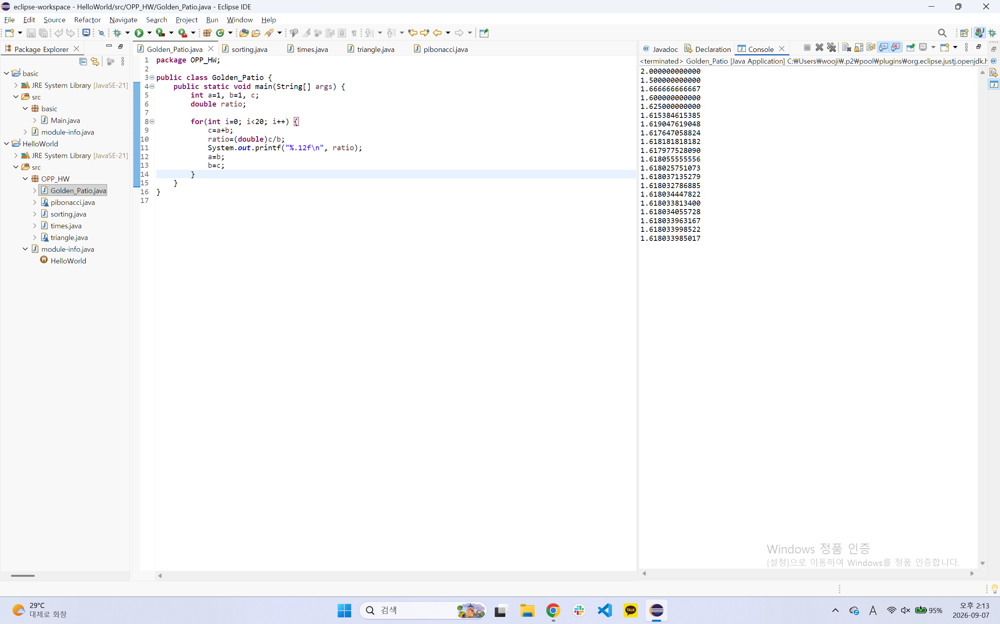
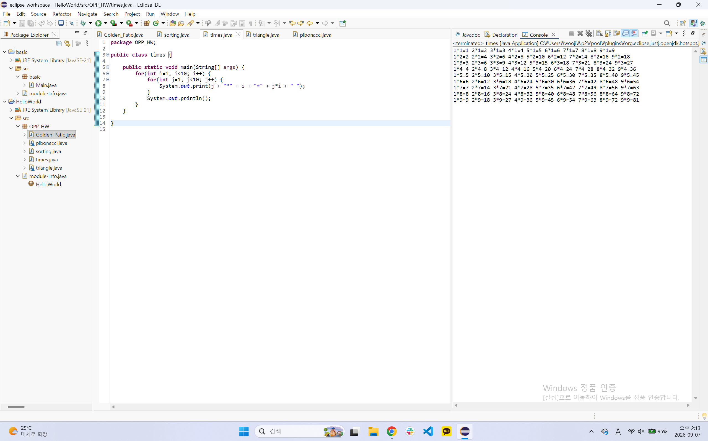

# OOP2026
### Homework1
```java
class triangle {
    public static void main(String[] args) {
        for (int i=0; i<10; i++){
            for(int j=0; j<=i; j++){
                System.out.print("#");
            }
            for(int j=i+1; j<10;j++){
                System.out.print(" ");
            }
            System.out.println();
        }
        System.out.println();

        for (int i=0; i<10; i++){
            for(int j=i; j<10; j++){
                System.out.print("#");
            }
            for(int j=0; j<=i-1; j++){
                System.out.print(" ");
            }
            System.out.println();
        }
        System.out.println();

        for (int i=0; i<10; i++){
            for(int j=i+1; j<10; j++){
                System.out.print(" ");
            }
            for(int j=0; j<=i; j++){
                System.out.print("#");
            }
            System.out.println();
        }
        System.out.println();

        for (int i=0; i<10; i++){
            for(int j=0; j<i; j++){
                System.out.print(" ");
            }
            for(int j=i; j<10; j++){
                System.out.print("#");
            }
            System.out.println();
        }    
    }
}
```



### Homework2
```java
class pibonacci {
    public static void main(String[] args) {
        int a=1, b=1, c;

        System.out.print("1 1 ");

        for(int i=0; i<18; i++){
            c = a+b;
            System.out.print(c+" ");
            a=b;
            b=c;
        }
    }
}
```



### Homework3
```java
public class Golden_Patio {
	public static void main(String[] args) {
		int a=1, b=1, c;
		double ratio;
		
		for(int i=0; i<20; i++) {
			c=a+b;
			ratio=(double)c/b;
			System.out.printf("%.12f\n", ratio);
			a=b;
			b=c;
		}
	}
}
```



### Homwork4
```java
public class times {

	public static void main(String[] args) {
		for(int i=1; i<10; i++) {
			for(int j=1; j<10; j++) {
				System.out.print(j + "*" + i + "=" + j*i + " ");
			}
			System.out.println();
		}
	}

}
```


